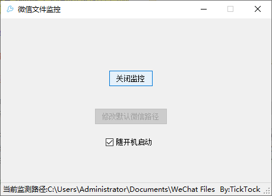

# WatchWxFiles

针对微信传文件变只读模式而制作的一个小工具，运行后可以对新传输的微信文件去掉其只读模式

## 环境

本项目是基于C#语言，在.net framework 4.7.2的基础上进行开发

## 使用方法

1. 打开程序后，默认检测微信文件路径为：`C:\User\%USERNAME%\Documents\WeChat Files`，若需要修改当前默认路径，请于微信设置-文件管理-文件管理处查看当前微信文件路径，并在程序中选择相应的文件夹
2. 开始监控

